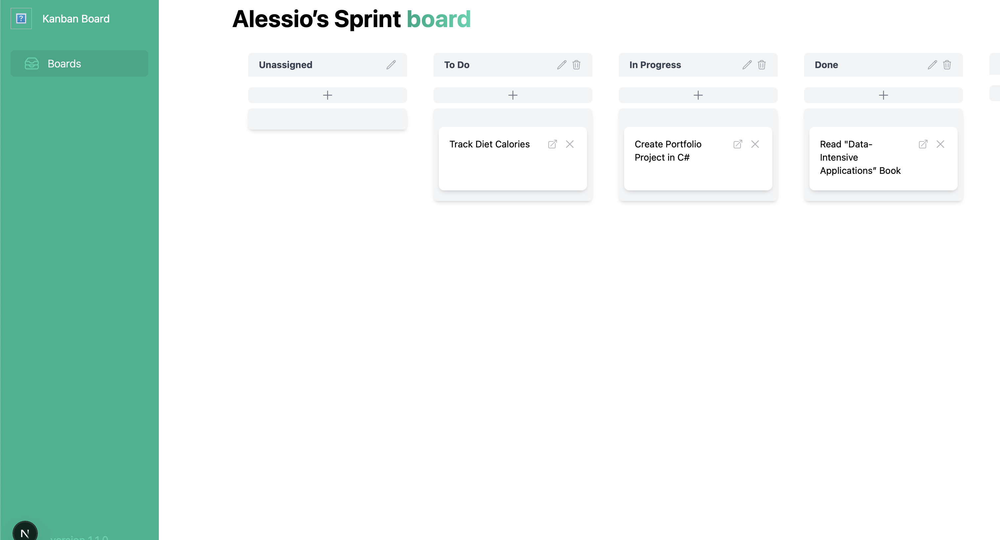

# Kanban Board (Rust + Next.js)

A simple, modern Kanban board with a **Next.js/React** frontend and a **Rust (Axum) + MongoDB** backend. Drag cards between columns, edit tasks, and persist everything in MongoDB.

<p align="center">
  
  <br/><br/>
  
  <br/><br/>
  
</p>

---

## Features

- 🧩 Boards with multiple columns (statuses)
- 📝 Create, edit, and delete tasks
- ↔️ Drag-and-drop between columns 
- 💾 Persistent storage in MongoDB
- ⚡️ Fast, async Rust backend with Axum/Tokio
- 🎨 Clean UI with Tailwind CSS + Headless UI + Heroicons
- 🔍 Typed models & JSON via Serde; structured logs via `tracing`

---

## Tech Stack


**Backend**
- Rust w/ Axum, Tokio, Tower/Tower-HTTP
- MongoDB official Rust driver, `bson`
- `serde`, `uuid`, `chrono`
- `tracing` + `tracing-subscriber`
- `dotenv` for local configuration


**Frontend**
- Next.js (React 18)
- Tailwind CSS, Headless UI, Heroicons
- `react-beautiful-dnd` for drag & drop
- Axios for API requests
- TypeScript

---

## Monorepo Layout

- client/ # Next.js frontend
- server/ # Rust (Axum) backend
- docs/ # Screenshots used in this README
- README.md


## How to run

### Run the backend

You need to first set up a `.env` file in the `server` folder and specify the `MONGO_URI` environment variable.
Then you may run:

```bash
cd server
cargo run
```

### Run the frontend
```bash
cd client
pnpm run dev
```

You may now open the app at [http://localhost:3000](http://localhost:3000)


## App preview


